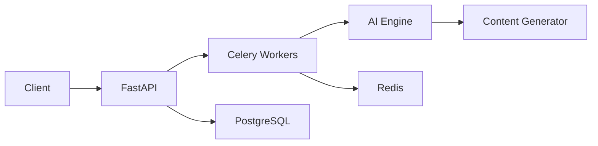

# BlogWise AI


BlogWise AI is an intelligent content generation platform that creates personalized blog posts using state-of-the-art AI algorithms. By analyzing trending topics and user preferences, it delivers engaging, contextually relevant content at scale.

[Live Demo](https://blogwise-ai.demo.com) | [Documentation](https://docs.blogwise-ai.com) | [API Reference](https://api.blogwise-ai.com)

## ✨ Features

- 🤖 **AI-Powered Content**: Advanced NLP models for high-quality content generation
- 📊 **Trend Analysis**: Real-time monitoring of trending topics
- 🎯 **Smart Personalization**: Learning algorithms adapt to user preferences
- 🚀 **High Performance**: Async processing with FastAPI and Celery
- 🔒 **Security**: Built-in authentication and rate limiting
- 📱 **API-First**: RESTful API design with comprehensive documentation

## 🏗️ Architecture



## 🛠️ Tech Stack

- **Backend**: FastAPI, Python 3.8+
- **AI/ML**: TensorFlow, spaCy, Hugging Face Transformers
- **Task Queue**: Celery, Redis
- **Database**: PostgreSQL
- **Infrastructure**: Docker, Docker Compose
- **Package Management**: Poetry
- **Testing**: Pytest, Coverage

## 📁 Project Structure

```
blogwise-ai/
├── api/
│   ├── main.py           # FastAPI application
│   ├── routers/          # API endpoints
│   ├── models/           # Database models
│   └── services/         # Business logic
├── ai/
│   ├── engine.py         # AI processing core
│   ├── models/           # ML models
│   └── processors/       # Content processors
├── workers/
│   ├── celery.py         # Celery configuration
│   └── tasks/            # Background tasks
├── tests/                # Test suite
├── docker/               # Docker configurations
├── scripts/              # Utility scripts
├── docker-compose.yml
├── poetry.lock
└── pyproject.toml
```

## 🚀 Quick Start

### Prerequisites

- Python 3.8+
- Docker and Docker Compose
- Poetry
- PostgreSQL
- Redis

### Local Development

1. **Clone the repository**:
```bash
git clone https://github.com/yourusername/blogwise-ai.git
cd blogwise-ai
```

2. **Set up environment**:
```bash
poetry install
cp .env.example .env  # Configure your environment variables
```

3. **Start dependencies**:
```bash
docker-compose up -d redis postgres
```

4. **Run migrations**:
```bash
poetry run alembic upgrade head
```

5. **Start the application**:
```bash
poetry run uvicorn api.main:app --reload
```

### Docker Deployment

```bash
docker-compose up --build
```

## 📚 API Documentation

Once running, access:
- Interactive API docs: `http://localhost:8000/docs`
- OpenAPI spec: `http://localhost:8000/openapi.json`

## 🧪 Testing

Run the test suite:
```bash
poetry run pytest
```

With coverage:
```bash
poetry run pytest --cov=api --cov-report=html
```

## 🤝 Contributing

1. Fork the repository
2. Create your feature branch
   ```bash
   git checkout -b feature/amazing-feature
   ```
3. Run tests and lint
   ```bash
   poetry run pytest
   poetry run flake8
   ```
4. Commit your changes
5. Push and create a Pull Request

## 📈 Performance Monitoring

Monitor your deployment:
- Application metrics: `/metrics`
- Health check: `/health`
- Status page: https://status.blogwise-ai.com

## 🔐 Security

Report security vulnerabilities to security@blogwise-ai.com

## 📄 License

This project is licensed under the MIT License - see [LICENSE](LICENSE) for details.

## 🙏 Acknowledgments

- [OpenAI GPT-3](https://openai.com) for language model inspiration
- [FastAPI](https://fastapi.tiangolo.com/) for the amazing web framework
- [Celery](https://docs.celeryproject.org/) for distributed task processing

---
